# DSA LeetCode Interview Agent

A voice-powered DSA interview agent that integrates speech-to-text, LeetCode API, OpenAI GPT, and text-to-speech for interactive coding interview practice and technical discussions.

## System Architecture

```mermaid
graph TB
    subgraph "User Interface"
        User[👤 User]
        Mic[🎤 Microphone]
        Speaker[🔊 Speaker]
    end
    
    subgraph "Core Application"
        App[🎙️ VoiceQAApp<br/>Main Controller]
    end
    
    subgraph "Speech Processing"
        STT[📝 SpeechToText<br/>Whisper Model]
        TTS[🔊 TextToSpeech<br/>pyttsx3]
    end
    
    subgraph "AI & Data Processing"
        QA[🧠 QAProcessor<br/>OpenAI GPT]
        LeetMCP[📊 LeetCodeMCPClient<br/>MCP Server]
        LeetAPI[🔗 LeetCodeAPIClient<br/>Direct API]
    end
    
    subgraph "External Services"
        OpenAI[🤖 OpenAI API<br/>GPT Models]
        LeetCode[💻 LeetCode<br/>Problems & Data]
        Whisper[🎯 Whisper<br/>Speech Models]
    end
    
    %% User interactions
    User -->|Voice Input| Mic
    Speaker -->|Audio Output| User
    
    %% Main flow
    Mic -->|Audio Stream| STT
    STT -->|Transcribed Text| App
    App -->|Text Query| QA
    QA -->|AI Response| App
    App -->|Response Text| TTS
    TTS -->|Audio Output| Speaker
    
    %% Data sources
    QA -->|API Calls| OpenAI
    QA -->|Problem Data| LeetMCP
    QA -->|Problem Data| LeetAPI
    LeetMCP -->|MCP Protocol| LeetCode
    LeetAPI -->|REST API| LeetCode
    STT -->|Model Loading| Whisper
    
    %% Styling
    classDef userClass fill:#e1f5fe,stroke:#01579b,stroke-width:2px
    classDef coreClass fill:#f3e5f5,stroke:#4a148c,stroke-width:2px
    classDef processClass fill:#e8f5e8,stroke:#1b5e20,stroke-width:2px
    classDef aiClass fill:#fff3e0,stroke:#e65100,stroke-width:2px
    classDef externalClass fill:#fafafa,stroke:#424242,stroke-width:2px
    
    class User,Mic,Speaker userClass
    class App coreClass
    class STT,TTS processClass
    class QA,LeetMCP,LeetAPI aiClass
    class OpenAI,LeetCode,Whisper externalClass
```



## Features

- 🎤 **Speech Recognition**: Uses OpenAI Whisper for accurate speech-to-text conversion
- 🧠 **AI-Powered Responses**: Integrates with OpenAI GPT for intelligent question answering
- 🔊 **Text-to-Speech**: Converts AI responses back to natural-sounding speech
- 💻 **LeetCode Integration**: Access to problems, solutions, and coding interview scenarios
- 💬 **Interactive Mode**: Continuous voice conversation loop for interview practice
- 🛠️ **Fallback Support**: Works even without OpenAI API key (limited functionality)

## Setup

### 1. Virtual Environment
```bash
python3 -m venv venv
source venv/bin/activate  # On Windows: venv\Scripts\activate
```

### 2. Install Dependencies
```bash
pip install -r requirements.txt
```

### 3. Set OpenAI API Key (Recommended)
```bash
export OPENAI_API_KEY='your-api-key-here'
```

## Usage

### Quick Start
```bash
python voice_qa_app.py
```

### Component Testing
Run individual component tests:
```bash
# Test speech-to-text
python speech_to_text.py

# Test text-to-speech
python text_to_speech.py

# Test Q&A processor
python qa_processor.py
```

## How It Works

1. **Listen**: Records your voice using the microphone
2. **Transcribe**: Converts speech to text using Whisper
3. **Process**: Sends question to OpenAI GPT for intelligent response
4. **Speak**: Converts AI response to speech and plays it back

## Configuration Options

### Whisper Model Sizes
- `tiny`: Fastest, least accurate
- `base`: Good balance (default)
- `small`: Better accuracy
- `medium`: High accuracy
- `large`: Best accuracy, slowest

### Voice Settings
Modify `text_to_speech.py` to adjust:
- Speech rate
- Volume
- Voice selection

## Example Interaction

```
🎤 Recording for 5 seconds... Speak now!
📝 Transcribed: 'What is machine learning?'
🧠 Processing your question...
🤖 Response: Machine learning is a branch of artificial intelligence that enables computers to learn and improve from experience without being explicitly programmed...
🔊 Speaking: [AI response converted to speech]
```

## Troubleshooting

### Audio Issues
- Ensure microphone permissions are granted
- Check system audio settings
- Try different Whisper model sizes

### OpenAI API Issues
- Verify API key is set correctly
- Check API quota/billing
- App works with fallback responses if API unavailable

### Dependencies
If installation fails, try:
```bash
# For audio libraries on Ubuntu/Debian
sudo apt-get install portaudio19-dev python3-pyaudio

# For macOS
brew install portaudio
```

## Commands

While running the app, you can say:
- "quit", "exit", "stop", or "bye" to end the session
- Any question or statement for AI response
- Use Ctrl+C to force quit

## Files Structure

- `voice_qa_app.py`: Main application controller
- `speech_to_text.py`: Whisper speech recognition integration
- `text_to_speech.py`: Text-to-speech functionality  
- `qa_processor.py`: OpenAI API and LeetCode integration
- `leetcode_api_client.py`: Direct LeetCode API client
- `leetcode_mcp_client.py`: LeetCode MCP server client
- `requirements.txt`: Python dependencies
- `install_dependencies.sh`: System dependency installer

## License

Open source - feel free to modify and use as needed!